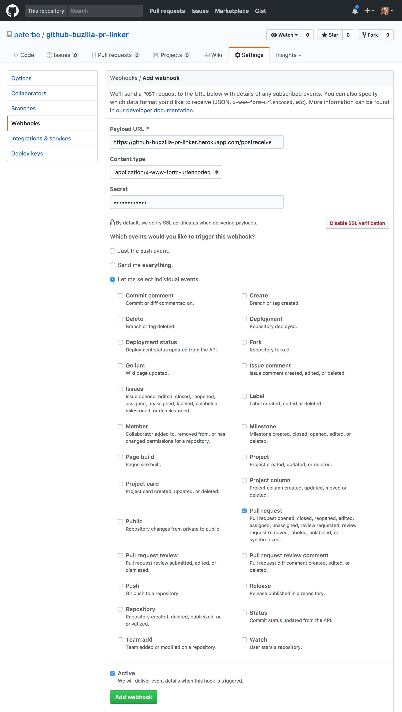

What this is
============

A webhook that can automatically create Bugzilla attachments
when new GitHub Pull Requests are created.

It does this but looking at the first line of the commit message and
looks for a Bugzilla bug ID. Then if that bug can be found (and doesn't
already have a link) it creates an attachment which is a link that redirects
to the Pull Request on GitHub.

How to use
==========

To enable this you need to go into your GitHub project's **Settings** and
click **Webhooks**. The click the **Add webhook** button (top right corner).

There, type in the the following:

  **Payload URL:** `https://github-bugzilla-pr-linker.herokuapp.com/postreceive`

  **Content type:** `application/x-www-form-urlencoded`

  **Which events would you like to trigger this webhook?** Click the
  `Let me select individual events.` option. Check the `Pull request`
  checkbox and uncheck all others.

License
=======

[MPL2](http://www.mozilla.org/MPL/2.0/)

Heroku
======

At the moment this Flask app is deployed on Heroku, using the
Mozilla corporate account, under the name
[github-bugzilla-pr-linker](https://dashboard.heroku.com/apps/github-bugzilla-pr-linker).
